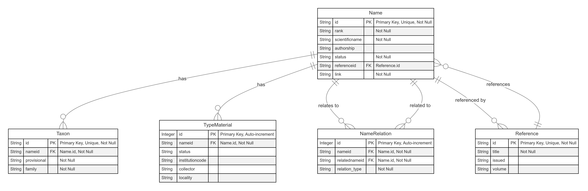
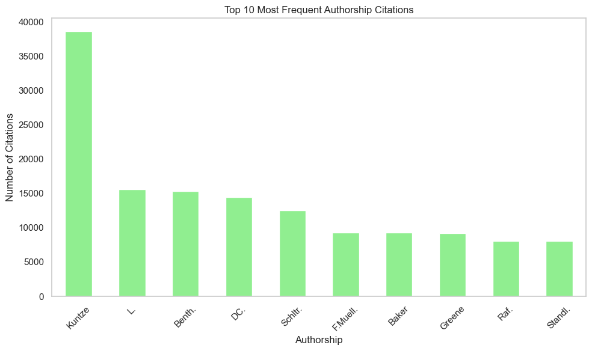
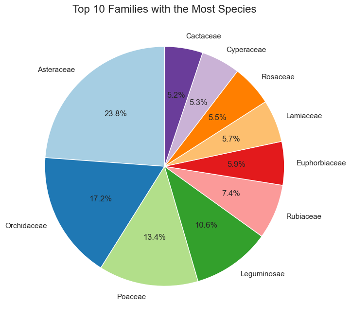
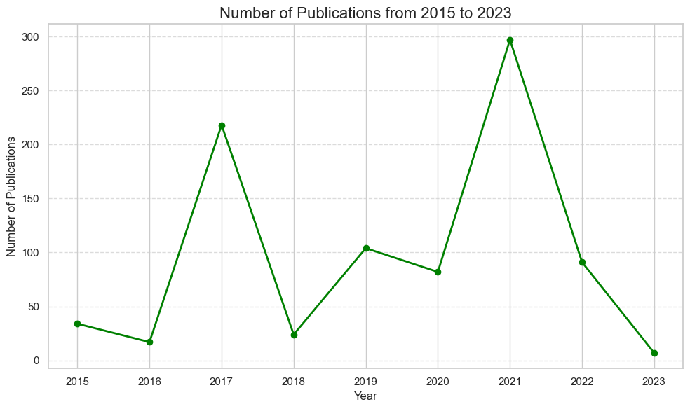
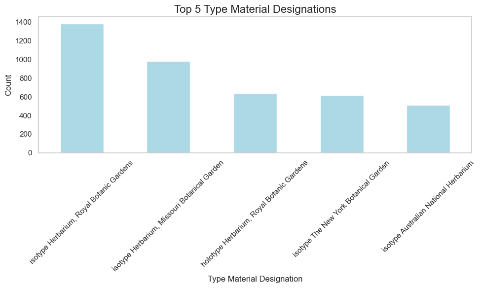
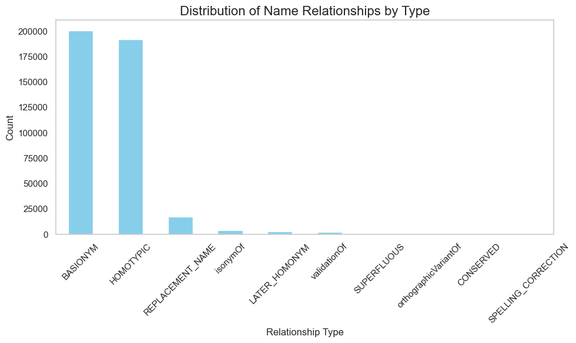

# 🌱 International Plant Names Index (IPNI)
# objective
#### "Developing a Python Framework for Accessing and Analyzing Plant Taxonomy Data from the International Plant Names Index (IPNI)" 
Arya Mohanan, Eslam Elmahdy, Kruti Narayan Nimbaragi, Siya Desai

Publication date: 2025-02-28

#### Affiliations
B-IT, Department of Life Science Informatics and Data Science, Rheinische Friedrich-Wilhelms-Universität, Friedrich-Hirzebruch-Allee 5/6, Bonn D-53115, Germany.

# Corresponding Authors

[Arya Mohanan](https://gitlab.informatik.uni-bonn.de/mohanana1), [Eslam Elmahdy](https://gitlab.informatik.uni-bonn.de/elmahdye1), [Kruti Narayan Nimbaragi](https://gitlab.informatik.uni-bonn.de/nimbaragik1) and [Siya Desai](https://gitlab.informatik.uni-bonn.de/desais0)

# Contributions
- Arya Mohanan
  - Data Exploration and cleaning (test _db.db)
  - Carried out Statistical analysis
  - Migration of data into Mysql
  - Implemented the MkDocs documentation

- Eslam Elmahdy
  - Data Exploration and cleaning (Tools)
  - Database Management System (Modules manager, models)
  - API Implementation (Modules schemas, main, tags)
  - Final Review of the project & Debugging

- Kruti Narayan Nimbaragi
  - Wrote the project report
  - Contributed in data exploration & cleaning (test _db.db)
  - Carried out study on the dataset for each column (db_description/Readme.md)
  - Graphical statistical analysis
  
- Siya Desai
  - Data Exploration and preprocessing
  - Docker
  - Podman-compose
  - Wrote Readme.md

# Abstract

This project introduces a Python framework designed to streamline access, analysis, and visualization of plant taxonomy and nomenclature data from the International Plant Names Index (IPNI).  By leveraging `FastAPI` for API development, `SQLite` and `MySQL` for robust data storage, and `Docker` for portability, this system offers researchers a scalable solution for querying plant names, references, and type specimens. The integration of geospatial data enhances its utility for taxonomic research and plant species classification.  This framework aims to standardize plant name management, improve data accessibility, and facilitate advanced analyses for biodiversity research.

# Introduction

**IPNI** provides nomenclatural data (spelling, author, types and first place/date of publication) for the scientific names of vascular plants from family to infraspecific ranks. The nomenclatural data and name registration provided by IPNI is produced by a collaboration between `The Royal Botanic Gardens Kew`, `The Harvard University Herbaria` and `The Australian National Herbarium` hosted by **The Royal Botanic Gardens, Kew**

# Background

Managing ethnobotanical data efficiently is a challenge due to fragmented databases, inconsistent nomenclature, and limited query access. The International Plant Names Index (IPNI) is a key resource for plant taxonomy, but existing systems often lack real-time querying, scalable storage, and geospatial integration.

This project develops a FastAPI-based ethnobotanic management system using MySQL, SQLite, phpMyAdmin, and Docker to enable efficient querying, scalable storage, and better plant name tracking. By integrating modern database technologies with structured APIs, it enhances plant taxonomy research and biodiversity analysis.

# Methods
The project follows a structured pipeline:

#### 📂 Data Collection → 🧹 Data Cleaning & Standardization → 📊 Database Design & Modeling → 🔧 API Development → ✅ Testing & Validation → 📦🐳🛠 Containerization and Deployment

#### 1. Dataset Collection and Alternative Data Source
The initial dataset for this project was intended to be sourced directly from the `International Plant Names Index (IPNI)`. However, due to limitations on the IPNI website, which restricts data extraction to 10,000 records at a time, it was deemed impractical for our purposes. As an alternative, data was sourced from the `Global Biodiversity Information Facility (GBIF)`, which provides comprehensive open-access biodiversity data. The required dataset, available as a ZIP file from GBIF, contains five tab-separated value (TSV) files: `Name.tsv`, `NameRelation.tsv`, `Taxon.tsv`, `Reference.tsv`, and `TypeMaterial.tsv`. These files serve as the foundation for the database, offering detailed information on plant names, references, taxonomic relationships, and type specimens.

Data can be downloaded via- "https://hosted-datasets.gbif.org/datasets/ipni.zip"

#### 2. Database Design and Modeling

A key aspect of the project was the design of a relational database schema that effectively stores and manages the complex relationships within plant data. The following steps were involved in the schema design:

- *Entity Identification*: The primary entities from the IPNI dataset were identified as Name, Reference, Taxon, NameRelation, and TypeMaterial. These entities capture essential information about plant names, their references in literature, taxonomic relationships, and type specimens (e.g., holotypes, isotypes).

- *Schema Design*: Using SQLAlchemy, an Object-Relational Mapping (ORM) tool, the database schema was defined. SQLAlchemy models were created for each entity, and relationships between entities were established using `ForeignKey` and relationship() functions.

- *Normalization and Constraints*: The database schema was normalized to avoid redundancy and ensure data integrity. Constraints were applied, including `primary keys`, unique constraints, and nullable properties, to maintain the quality and consistency of the data.

- *ER Diagram*: An Entity-Relationship (ER) Diagram was created to visually represent the relationships between the identified entities. This diagram illustrates how the key entities (such as Name, Reference, and Taxon) are interconnected, providing a clear understanding of the database structure. The ER diagram is shown below.

*Figure 1*: ER diagram illustrating the relationships between the key entities in the ipni database.

#### 3. Data Cleaning and Standardization
Once the data was obtained, the next step was to clean and standardize it to ensure consistency before loading it into the database. This process involved several sub-steps:

- Column Name Standardization: A function was developed to standardize column names, converting them to lowercase and replacing non-alphanumeric characters with underscores.

- Data Cleaning: Duplicate records were removed using the `drop_duplicates()` function in Pandas, and multiple whitespaces were replaced with a single space to improve data consistency.

- Data Type Consistency: All columns were checked to ensure they adhered to the expected data types. For instance, all textual fields were standardized to strings to prevent issues when querying the database.

- Tools: Pandas was utilized for data manipulation and cleaning, while Regular Expressions (re) were employed for pattern matching and string manipulation.

#### 4. Database Management
The next phase involved creating the database tables, inserting the cleaned data, and managing database operations efficiently. To improve query performance and optimize the database, we implemented indexing techniques on frequently queried fields. This reduced the time taken for complex queries and improved the overall efficiency of data retrieval.

This phase included the following steps:

- Table Management: Using SQLAlchemy, tables were created in the relational database by calling the create_all() method. During testing and development, these tables were dropped and recreated as necessary.

- Data Import: Cleaned data was loaded into Pandas DataFrames and then inserted into the database, ensuring referential integrity by maintaining the correct order of entity insertion.

- Session Management: Database transactions were managed using SQLAlchemy's session functionality, ensuring that changes were committed to the database. The session also allowed for transaction rollback in case of errors.

- Error Handling: Comprehensive error handling mechanisms were implemented to maintain data integrity and consistency during the import process. Logs were created to track and address any issues encountered during data insertion.

#### 5. API Development
A crucial component of the project was the development of a RESTful API to enable interaction with the database. This API allows users to query, update, and retrieve data from the database. The following steps were involved in API development:

- Endpoint Design: A set of endpoints was defined for each key entity (e.g., /names, /references, /taxons), supporting CRUD operations (Create, Read, Update, Delete) for each.

- Data Serialization: To facilitate data exchange between the client and server, Pydantic schemas were used for data validation and serialization. This ensures that the data returned by the API is structured and adheres to the expected format.

- Custom Endpoint: A custom endpoint was created to retrieve extended metadata for a specific Name record, including related Reference, Taxon, and TypeMaterial data. This provides researchers with more detailed information about each plant name.

- Error Handling: HTTP exceptions (e.g., 404 Not Found, 400 Bad Request) were implemented to handle invalid requests, ensuring a robust and user-friendly API.

#### 6. Testing and Validation
To ensure the system's functionality and reliability, rigorous testing was conducted throughout the development process:

- Unit Testing: Unit tests were written to validate the functionality of individual components, such as data cleaning functions (e.g., `get_standard_column_name`) and database operations.

- Integration Testing: Integration tests were conducted to verify that the data flowed correctly from the TSV files through the database and API, ensuring that no data integrity issues occurred during the entire process.

- Edge Case Handling: Edge cases, such as missing or malformed files and inconsistent data formats, were thoroughly tested to ensure the system could handle such scenarios gracefully.

- Tools: Pytest was used for unit and integration testing, and logging was implemented to track errors and debug issues during the testing phase.

#### 7. Containerization and Deployment
To streamline development, testing, and deployment processes, the project utilizes containerization technologies. A dedicated Dockerfile is used to create a reproducible environment for the FastAPI-based Taxonomy Database Management System. This file sets up a `Python 3.12` environment, installs dependencies using `PDM`, and configures the `FastAPI server` to run on port 81.

Containerization ensures the application runs consistently across different environments. By using Docker, the system becomes portable, enabling easy deployment across various machines without concerns about system compatibility. This approach enhances reproducibility, facilitates collaboration, and guarantees consistent behavior across different platforms.

*Note*: Ensure that the port for phpMyAdmin is set to 8081, as previously mentioned.

- #### Deployment Process
To set up and run the application, follow these steps:

- Start Docker Desktop
- Ensure that Docker Desktop is running on your machine.

- Clone the Project Repository

- In the project directory, build and run the containers using Docker Compose:
`"docker-compose up --build -d"`

- Access the Services
Once the services are up and running, you can access them:

  - FastAPI Interface: Navigate to localhost:8080/docs to access the FastAPI documentation and interact with the endpoints.
  - Migrate Data:  Migrate Data to initialize the database and populate it with the required information.
  - phpMyAdmin: Access the web-based interface at `localhost:8081` for database management.
    - Username: `root`
    - Password: `root_passwd`
  
- MySQL Database: The MySQL database can be accessed directly from the host machine at `localhost:3306` for querying or administrative tasks.

# Results & Statistical Analysis
The goal of the statistical analysis was to assess the completeness, consistency, and quality of the datasets. By identifying key patterns and anomalies, we aimed to uncover insights that could improve the overall accuracy and usability of the IPNI data.

#### 1. Overview of the Analysis
The analysis conducted on the datasets, which include Names.tsv, NameRelation.tsv, Taxon.tsv, Reference.tsv, and TypeMaterial.tsv, focused on evaluating the data's completeness, distribution, and relationships. The primary aim was to uncover insights into the taxonomy, naming conventions, type materials, and associated references in plant taxonomy. In addition, missing data, inconsistencies, and outliers were identified to inform future data improvements.
#### 2. Datasets Overview
- Name.tsv: The dataset contains a total of 1,315,760 scientific names, a key record in taxonomic research. It includes authorship and taxonomic rank information that supports the accurate documentation of plant nomenclature.

- NameRelation.tsv: This file documents relationships between plant names, including basionyms, homotypic names, and conserved names, which are essential for understanding the historical and current status of plant names.

- Taxon.tsv: The dataset provides information about plant taxa, including provisional status, plant family, and species counts. It reveals the diversity of plant families and the provisional status of many taxa.

- Reference.tsv: This dataset includes references from the year 1700 to 2024, offering valuable insights into the historical and contemporary sources of plant taxonomy.

- TypeMaterial.tsv: The dataset catalogs type specimens linked to plant names, detailing the roles of these specimens in taxonomic validation and supporting the scientific understanding of plant species.

#### 3. Key Findings
- The `Name.tsv` dataset contains 1,315,760 scientific names, with 739,648 entries having incomplete information.
The dataset includes 74 taxonomic rank categories, with Kuntze being the most frequently cited author (38,584 mentions).

*Figure 2*: Top 10 authorships

- The `Taxon.tsv` dataset records 879 plant families, with Asteraceae and Orchidaceae having the highest species counts, 171,453 and 123,917, respectively.
There are 1,777,534 provisional taxa in the Taxon.tsv dataset, indicating a large portion of the entries are yet to be fully validated.

*Figure 3*: Top 10 Families with most species

- The `Reference.tsv` dataset shows a steady publication trend over the years, with a noticeable decline in publications from 2017 onwards.

*Figure 4*: Number of publications in recent years (2015-2023)

- The `TypeMaterial.tsv` dataset documents 7,267 type material designations, with the Royal Botanic Gardens and Missouri Botanical Garden contributing the most specimens.

*Figure 5*: Top 5 type material designations

- `NameRelation.tsv` shows 200,751 basionyms, 191,867 homotypic names, and 15,351 names that have been replaced, reflecting ongoing taxonomic revisions.

*Figure 6*: Distribution of Name relationships by type

# Discussion and Implications
The datasets analyzed provide significant insights into plant taxonomy, with several key patterns emerging:

- Gaps in Data: A substantial number of scientific names (739,648) have incomplete information. This highlights a critical area for improvement, where missing data can affect taxonomic accuracy, and further research is needed to fill these gaps.

- Dominant Plant Families: The Asteraceae and Orchidaceae families dominate the species counts, which may suggest a focus in plant research on these families or their ecological importance. This trend could influence future biodiversity studies and conservation efforts.

- Provisional Taxa: A high number of provisional taxa points to a significant portion of the dataset still under validation. Provisional statuses call for careful verification to ensure data reliability and taxonomic accuracy.

- Declining Publications: The recent decline in the number of publications from 2017 onwards may indicate a slowdown in the volume of new taxonomic research or reflect challenges in accessing newer data sources. Further investigation into this trend may help understand the evolving landscape of plant taxonomy.

- Institutional Contributions: Institutions like the Royal Botanic Gardens and Missouri Botanical Garden have made substantial contributions to type material documentation, offering a rich resource for taxonomic validation and further studies in plant taxonomy.

- Relationships Between Plant Names: The analysis of name relations revealed substantial numbers of basionyms, homotypics, and replaced names, suggesting a dynamic and evolving taxonomy where names are frequently revised and updated.

# Conclusion

This statistical analysis provides a detailed understanding of the various aspects of plant taxonomy, highlighting key trends and areas that require attention. While the data on taxonomic names, plant families, and references is comprehensive, there are significant gaps in missing data, provisional taxa, and the decline in recent publications that warrant further exploration.

Future work could focus on improving data completeness, standardizing naming conventions, and exploring the dynamics of plant family distributions. The framework we’ve developed not only addresses the current gaps in plant taxonomy research but also lays the foundation for future advancements in the field, empowering researchers to make more informed and timely discoveries.

# Acknowledgment
We would like to express our gratitude to the Department of Life Science Informatics and Data Science at Rheinische Friedrich-Wilhelms-Universität for their unwavering support. Our heartfelt thanks go to our colleagues and testers for their insightful feedback and contributions throughout the development process.

# References

- Schultz, F., & Garbe, L. A. (2023). How to approach a study in ethnopharmacology? Providing an example of the different research stages for newcomers to the field today. *Pharmacology Research & Perspectives*, 11(4), e01109. https://doi.org/10.1002/prp2.1109

- International Plant Names Index. (2025). *International Plant Names Index*. The Royal Botanic Gardens, Kew, Harvard University Herbaria & Libraries, & Australian National Herbarium. Retrieved from http://www.ipni.org

- Turland, N. J., et al. (2018). *International Code of Nomenclature for algae, fungi, and plants (Shenzhen Code)*. Regnum Vegetabile. International Association for Plant Taxonomy (IAPT).

- Mamirova, A., Pidlisnyuk, V., Amirbekov, A., et al. (2021). Phytoremediation potential of *Miscanthus sinensis* And. in organochlorine pesticides contaminated soil amended by Tween 20 and activated carbon. *Environmental Science and Pollution Research*, 28, 16092–16106. https://doi.org/10.1007/s11356-020-11609-y
